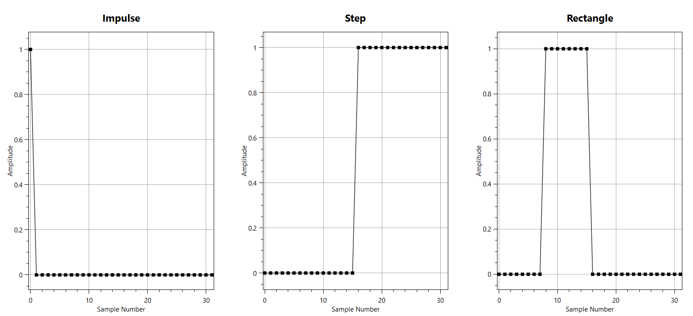
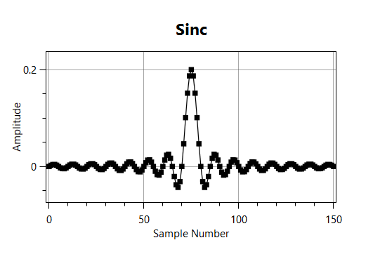
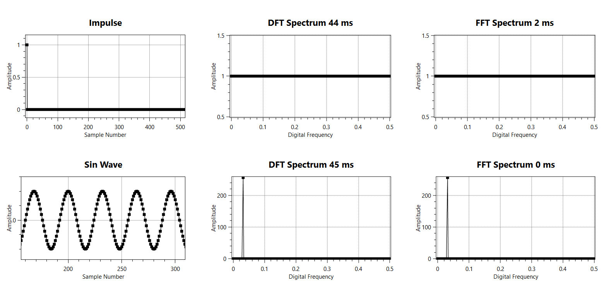
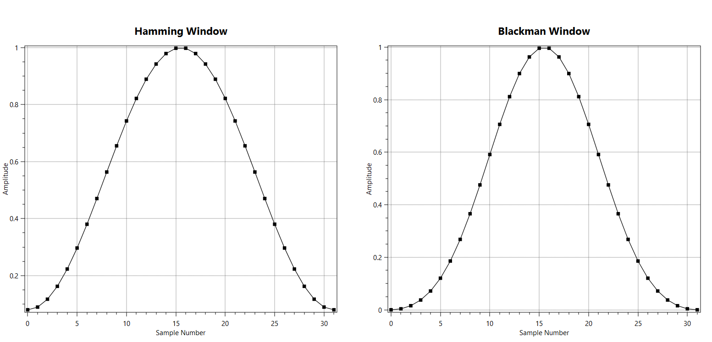
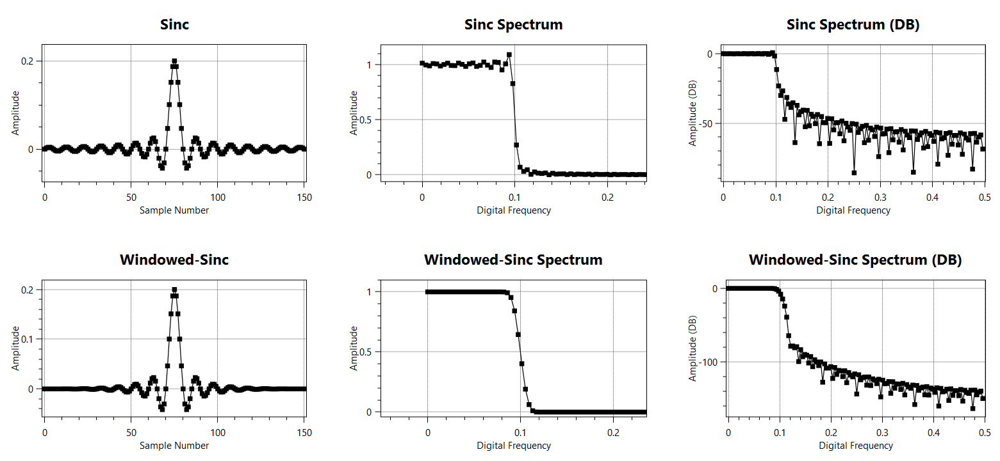
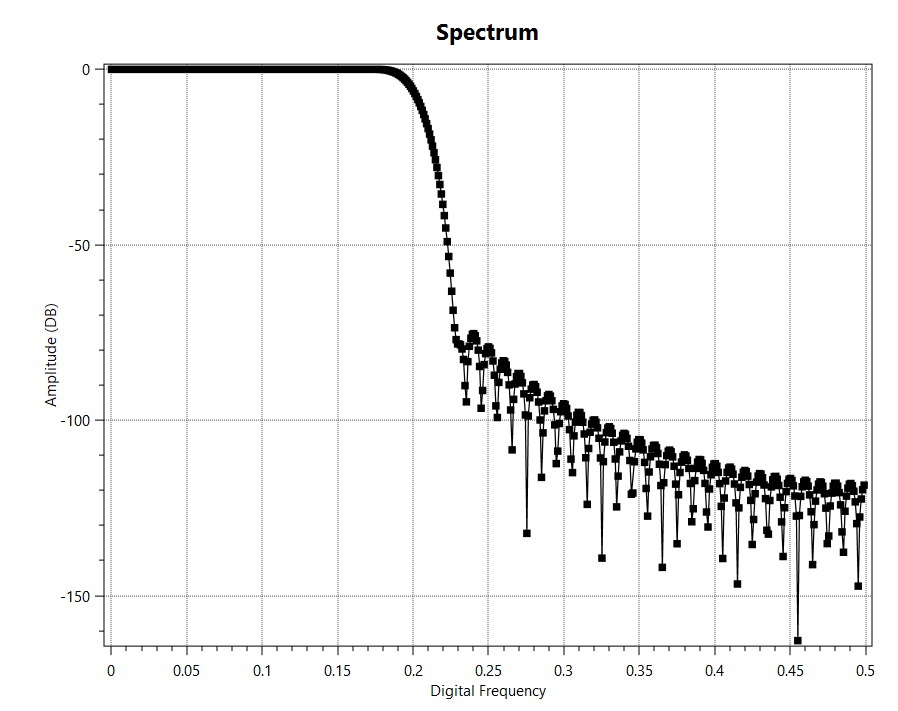
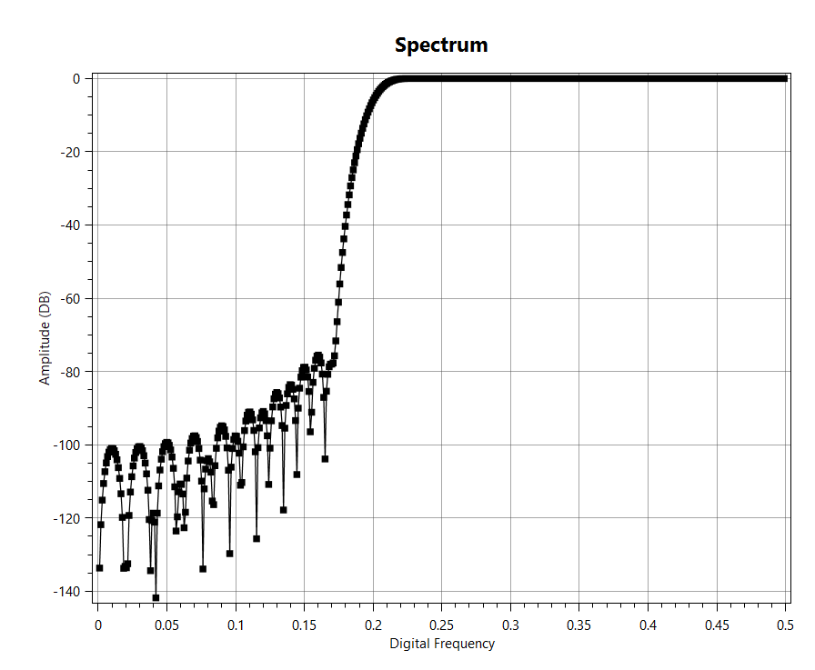
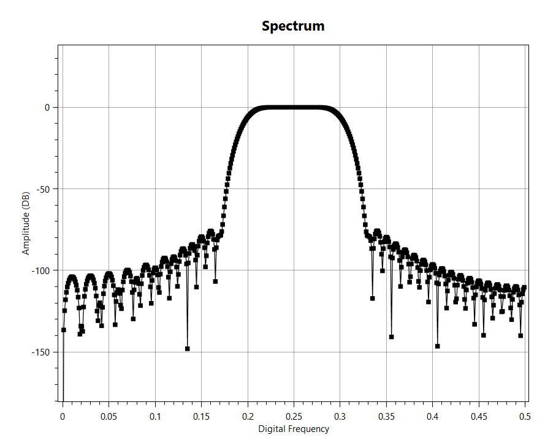
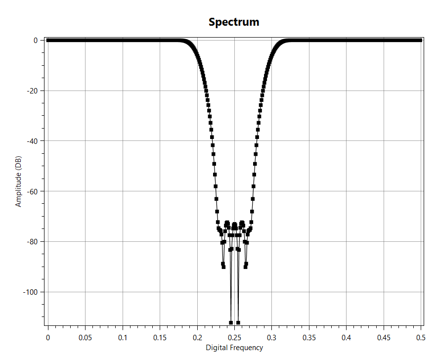

# DigitalSignalProcessing
Implementation of many common Digital Signal Processing (DSP) algorithms. The focus is on 1D signals with the potential for adding 2D data (such as images) later on. The accompanying WPF Showcase application is used for visualizing the performance of the algorithms. The [OxyPlot](https://github.com/oxyplot/oxyplot) toolbox was used for plotting data.

Sources:
- [The Scientist and Engineer's Guide to Digital Signal Processing](https://www.analog.com/en/education/education-library/scientist_engineers_guide.html#Foundations)
- [Optimizing 1D Convolution](https://stackoverflow.com/questions/7237907/1d-fast-convolution-without-fft)
- [Discrete Fourier Transform](https://en.wikipedia.org/wiki/Discrete_Fourier_transform)
- [Cooley-Tukey Fast Fourier Transform](https://en.wikipedia.org/wiki/Cooley%E2%80%93Tukey_FFT_algorithm)
- [Calculating inverse FFT from forward FFT](https://flylib.com/books/en/2.729.1/computing_the_inverse_fft_using_the_forward_fft.html)
- [Enumeration to ComboBox Options](https://stackoverflow.com/questions/6145888/how-to-bind-an-enum-to-a-combobox-control-in-wpf)
- [ICommand and RelayCommand MVVM design](https://stackoverflow.com/questions/1468791/icommand-mvvm-implementation)

Most of the algorithms will come from the textbook listed in the sources.

## 1D Convolution
The first major topic includes 1D convolution. The equation below shows how the 1D convolution between a signal x and a kernel h is calculated. With x having a length of N and h having a length of M, the output y will have a length of L = N + M - 1.

    

The values for i range from 0 to L - 1. A quick glance at this algorithm will show that, if not properly implemented, out of bounds exceptions can occur while trying to calculate the first and last M - 1 points in y. During a naive implementation of this algorithm, the index for x must be checked for every iteration of i to account for these boundary conditions. To avoid checking the indexing of x, the for loop for calculating the convolution can be unrolled into three separate loops. These loops are shown below in the updated equations for y.

    

Convolution is a key concept when filtering data in real world applications. Depending on the amount of data in a sequence that is being filtered and the length of the convolution kernel that is being used, significant speed increases can be obtained using the Fast Fourier Transform. This algorithm is explained in later sections. Many different variations of this algorithm can be made depending on the current application.

## Common Sequences
There are a few sequences that have useful properties and are important during applications in DSP. These sequences include the impulse, step, and rectangle sequences. The impulse sequence, particularly the unit impulse sequence, is used to mimic the dirac-delta function in continuous systems for digital applications. A unit impulse sequence has a value of one at the zero sample and a value of zero for every other sample. While the delta function is passed through a continuous system to derive it's impulse response function, the unit impulse sequence is passed through a digital system to obtain it's impulse response. The step sequence can be used to measure things such as rise time and the step response of a digital system. The rectangle sequence is a key sequence used in the design of filters. Examples of these sequences are shown below.

The rectangle sequence is closely related to the sinc sequence through the Fourier Transform. The continuous Fourier Transform of a rectangle window is the sinc function. A digital form of the sinc function can also be calculated. Both the continuous sinc function and discrete sinc sequence function is shown below.

    

    

This is a common representation of the discrete sinc sequence since it is commonly used to generate kernels for digital filters. The value of fc in the discrete sinc sequence is determined by what digital cutoff frequency is desired in the filter being designed. Below is a plot of the sinc sequence.

## Discrete Fourier Transform (DFT)
One of the most important algorithms for digital signal processing is the Discrete Fourier Transform (DFT). The DFT transforms a given signal into it's frequency components. This allows for a frequency analysis of a signal. This is crucial for filtering denoising, and frequency band isolation of signals. The DFT is calculated by correlating many complex sinusoidal waves with the given signal. The equation for the transform is shown below, where xn represents the original sequence at point n and Xk represents the frequency sequence at point k. The variable "i" represents the complex unit for the square root of -1.

    

## Fast Fourier Transform (FFT)
The main issue with the DFT is how computationally expensive it can become with large amounts of data. The algorithm itself has an O(N^2) computational cost. The Fast Fourier Transform (FFT) mitigates this computational cost by making use of the symmetrical properties of the DFT. This leads to a reduction in computational costs to O(NlogN) when implemented correctly. For this project, a version of the decimation in time Cooley-Tukey algorithm was used. The image below can show how much faster a 512 long FFT is compared to a 512 long DFT. This form of the algorithm is limited to signals with a sequence length that is a power of two.

## Common Windows
For digital filter design, the sinc sequence is commonly used in conjunction with spectral inversion and spectral reversal to design the four primitive filter types, low pass, high pass, band pass, and band reject filters. The only issue is that a perfect brickwall filter needs an infinitely long kernel sequence to avoid a phenomenon call spectral leakage and to prevent overshoot in the filter's frequence spectrum. Since a computer cannot hold an infinitely long filter kernel, the use of windows is necessary to imrpove filter performance. The general idea of a window is to cause the end points of a sequence to shrink in amplitude to prevent large amounts of spectral leakage caused by edge effects. Two of the most commonly used windows are the Blackman and Hamming windows. The equations for calculating sequences of length M and example plots are shown below.

    

    

## Finite Impulse Response (FIR) Filters
The general practice for digital filter design is to multiply elementwise between a sinc sequence and a window sequence to obtain a windowed-sinc lowpass filter kernel. These kernels are then manipulated using spectral inversion or reversal to make high pass, band pass, and band reject filters. Examples of the advantages of the windowed-sinc filter kernel over the sinc filter kernel are shown in the following plots. Notice the overshoot of the sinc filter kernel in the frequency domain and the stopband attenuation reaching only around -25 dB compared to around -80 dB for the windowed-sinc kernel.

Once the windowed-sinc filter kernel is derived, low pass, high pass, band pass, and band reject filters can all be generated by manipulating the filter kernels through spectral inversion, reversal, or adding together kernels. Examples of the frequency response of all four of these filter types is shown below.

## Showcase
I made a simple MVVM wpf application that has interactive controls and plots for each of these major topics. All plots shown in this readme were taken from this application. I forced myself to learn the ICommand interface and how to write a converter for enum to collections. The enum converter is especially helpful for presenting options, such as in a combo box, that map directly to enumerations made in the application.
